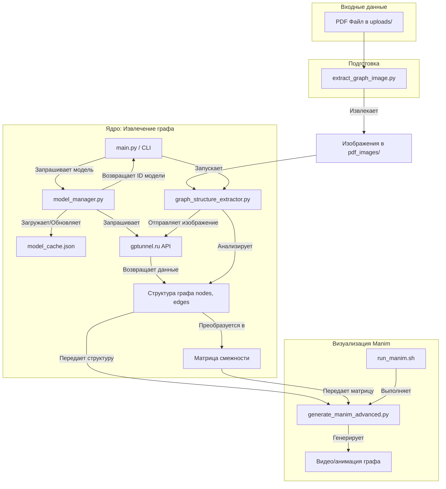

# Project Structure (graphf-extractor)

This diagram shows the main components and data flow of the project.

**Пояснения к схеме:**

1.  **Вход:** Пользователь помещает PDF-файл в папку `uploads/`.
2.  **Извлечение изображений:** Скрипт `graph_pipeline/extract_graph_image.py` обрабатывает PDF и сохраняет изображения его страниц в папку `pdf_images/`.
3.  **Запуск:** Основной процесс запускается через `graph_pipeline/main.py` (как CLI-инструмент), который инициирует извлечение структуры графа.
4.  **Извлечение структуры:**
    *   `graph_pipeline/graph_structure_extractor.py` берет изображение страницы.
    *   Он обращается к `graph_pipeline/model_manager.py`, чтобы получить подходящую *vision*-модель.
    *   `graph_pipeline/model_manager.py` отвечает за взаимодействие с API `gptunnel.ru`:
        *   Он загружает/обновляет кэш моделей (`model_cache.json`), запрашивая `/v1/models` у `gptunnel.ru`.
        *   Он может проверять *vision*-возможности моделей, отправляя тестовые запросы к `/v1/chat/completions`.
        *   Он возвращает ID подходящей модели (например, из списка `get_vision_models`).
    *   `graph_pipeline/graph_structure_extractor.py` отправляет изображение и выбранный ID модели в `gptunnel.ru` через эндпоинт `/v1/chat/completions` с запросом на извлечение узлов и ребер.
    *   API возвращает структуру графа.
5.  **Визуализация:**
    *   Полученная структура графа передается в `graph_pipeline/generate_manim_advanced.py`.
    *   Скрипт `run_manim.sh` запускает Manim для генерации анимации на основе этой структуры.
    *   Результатом является видеофайл анимации графа.

**Примечание:** Эта схема основана на анализе кода и может потребовать ручного обновления при значительных изменениях в структуре проекта.
